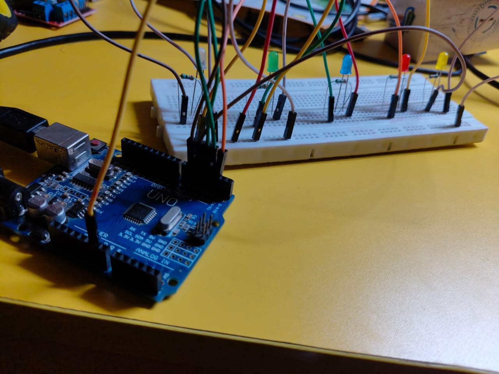
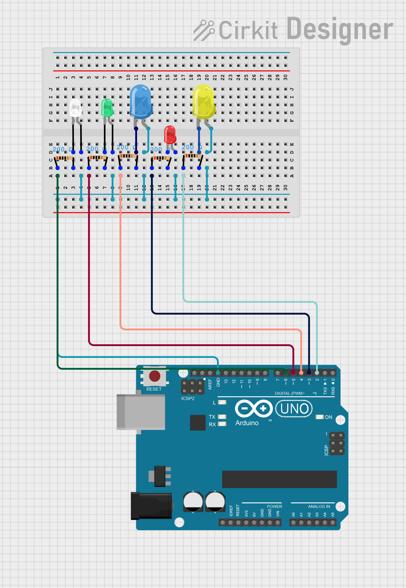

# ML_Gesture_LED
# 🤖 Gesture-Controlled LED Patterns using MediaPipe + Arduino

Control a series of colorful LED patterns using just your hand gestures!
This project combines **MediaPipe (hand detection)**, **OpenCV**, and an **Arduino Uno** to create a responsive and fun real-time interaction system.

 

---

## 🔧 Features

✨ Control 5 differently-colored LEDs
🖐️ Real-time hand gesture recognition using MediaPipe
🎯 Each gesture triggers a unique LED animation pattern
⚡ Fast and responsive using Python & serial communication
💡 Easily customizable with new patterns or gestures

---

## 🧰 Hardware Requirements

* Arduino Uno (or Nano/compatible)
* 5 × LEDs (different colors recommended)
* 5 × 220Ω resistors
* Breadboard + jumper wires
* USB cable (for Arduino ↔ PC connection)
* Webcam (built-in or external)

---

## 🧑‍💻 Software Requirements

* Python 3.9+
* Arduino IDE
* Python packages:

  ```bash
  pip install opencv-python mediapipe pyserial
  ```

---

## 🧠 Gesture-to-Command Mapping

| Gesture     | Finger Count | LED Pattern Triggered |
|-------------|--------------|-----------------------|
| Open Palm   | 5            | Pattern 1 - Chaser    |
| Fist        | 0            | Pattern 2 - All Blink |
| One Finger  | 1            | Pattern 3 - Bounce    |
| Two Fingers | 2            | Pattern 4 - Odd/Even  |

---

## 🚦 LED Pattern Descriptions

| Pattern | Name           | Description                                 |
| ------: | -------------- | ------------------------------------------- |
|       1 | Chaser         | Lights move forward in a sweeping motion    |
|       2 | All Blink      | All LEDs flash together repeatedly          |
|       3 | Bounce         | LEDs animate from end to end and reverse    |
|       4 | Odd/Even Blink | Alternating odd/even LEDs blink in sequence |

---

## 🛠️ Setup Instructions

### 1. 💻 Python + Gesture Control

1. Clone this repository:

   ```bash
   git clone https://github.com/nekunj44/ML_GESTURE_LED.git
   cd gesture-led-controller
   ```

2. Install dependencies:

   ```bash
   pip install opencv-python mediapipe pyserial
   ```

3. Run the script:

   ```bash
   python gesture_control.py
   ```

The system will auto-detect your Arduino’s COM port and start tracking your hand gestures using your webcam.

---

### 2. 🔌 Arduino LED Wiring

| LED | Color  | Arduino Pin | Resistor |
| --- | ------ | ----------- | -------- |
| 1   | Red    | D2          | 220Ω     |
| 2   | Green  | D3          | 220Ω     |
| 3   | Blue   | D4          | 220Ω     |
| 4   | Yellow | D5          | 220Ω     |
| 5   | White  | D6          | 220Ω     |

* Connect cathodes (short leg) of all LEDs to **GND**
* Upload the `led_patterns.ino` file from this repo using the Arduino IDE

# Connection
 

---

## 🔮 Ideas for Expansion

* Add support for custom gesture ML models
* Control NeoPixel or WS2812B LED strips
* Add speech + gesture combo control
* Make it into a smart lamp or wearable art

---

## 📂 Project Structure

```
gesture-led-controller/
├── gesture_control.py       # Main Python script (gesture detection & serial)
├── led_patterns.ino         # Arduino sketch (LED patterns)
├── README.md                # You're here
└── images/                  # Place for demo images/GIFs
```

---

## 👤 Author

**Nekunj**
[GitHub](https://github.com/nekunj44) 

---

## 📜 License

MIT License – use, modify, share freely.
Attribution is appreciated 😊
